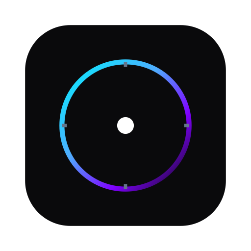
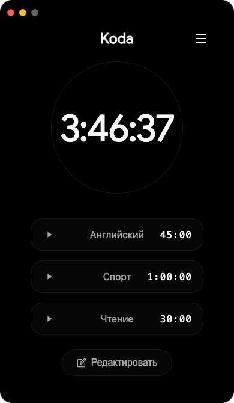
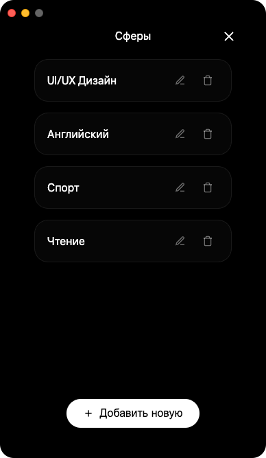
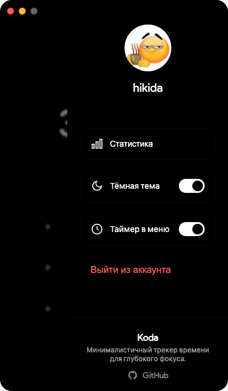
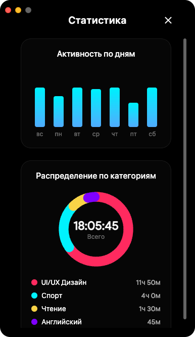

<div align="center">
  

  # Koda 

  Минималистичный трекер времени для глубокого фокуса.

  [](https://github.com/hikida444/Koda/actions/workflows/build.yml)
</div>

<br />

Koda — десктопное приложение-таймер, разработанное с упором на эстетику и отсутствие отвлекающих факторов. 

## Интерфейс

<div align="center">
  
  &nbsp;&nbsp;&nbsp;
  
  <br /><br />
  
  &nbsp;&nbsp;&nbsp;
  
</div>

## Установка

Готовые сборки для macOS и Windows доступны на странице [Releases](../../releases). 

**Для пользователей macOS:**
Так как приложение собирается без платного сертификата Apple Developer, система безопасности Gatekeeper может блокировать первый запуск. Для решения проблемы выполните в Терминале:
```bash
xattr -cr /Applications/Koda.app
```

## Сборка из исходников

```bash
git clone https://github.com/hikida444/Koda.git
cd Koda
npm install
npm start
```
Для генерации установочных файлов используйте команду `npm run build`.
